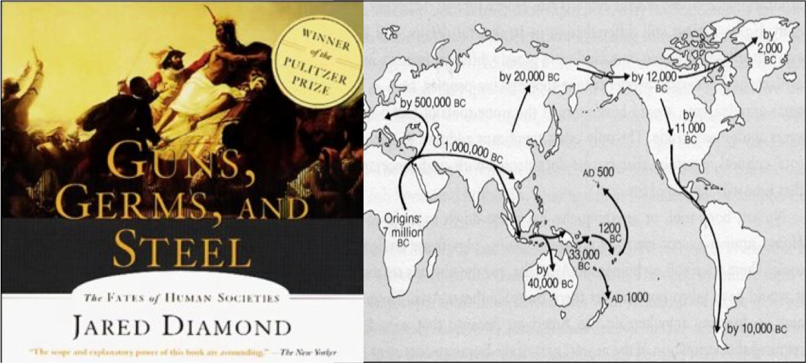

title: 第十期读书分享会（书目 《枪炮，病菌和钢铁》） by Winston
slug: 10-guns-germs-and-steel-by-winston
category: 活动预告

###分享人：Winston Wu  
一位有生物学背景的电脑软件质量工程师。喜爱爬山，宿营，读书， 写作。近年来迷恋《社会生物学－－－新的综合》 这样一门新的学科， 开始涉猎演化论和其相关的各个社会科学的所有内容。 更对人的生物学和社会学充满热情。 
###有关《枪炮，病菌和钢铁---人类社会的来龙去脉》 
自最后一个冰河期结束以来的１３０００年里，已经占领了欧洲、 中东和东南亚、澳洲的人类迅速又占领了地球的各个角落。 处于同一起跑线的人类，开始在世界各个不同的角落， 发展自己的文化和社会组织。 在资源的争夺与杀戮中繁殖自己的基因。 ８０００年以来的具有了新时期技术的中国从村落社会演变为部落社 会，夏之前的选贤与选能的政治制度（会盟）， 发展为周代以来的宗法制度； 社会组织形式从封建制度过渡向秦汉以后的中央集权制度。 然后以２０００年来的不断反复， 始终徘徊在铁器社会而没有发展出来如西欧的钢器技术。 是什么原因造成了今天中国的如此格局？２０多年前的问题， 今天有了更好的答案吗？ 

今天世界的格局为什么是这个样子？ 为什么强势文明发生发展在欧洲、亚洲而不是相反的非洲、美洲、太平洋岛屿？ 文明到底是什么？文化又是什么？文明的就是好的吗？原始的、野蛮的人们比较文明的人们就不幸福吗？ 不同种族在智力上的确有差异吗？ 寒冷、高纬度地区的人们要比赤道上及赤道周围的人们更勤劳、更富有创造力吗？ 

为什么是欧亚大陆人征服、赶走或大批杀死印第安人、澳大利亚人和非洲人，而不是相反？为什么么小麦和玉米、牛和猪以及现代世界的其他一些“不了起的”作物和牲畜出现在这些特定地区，而不是其他地区？在这部开创性的著作中，演化生物学家贾雷德.戴蒙德揭示了事实上有助于形成历史最广泛模式的环境因素，从而以震撼人心的力量摧毁了以种族主义为基础的人类史理论，因其突出价值和重要性，本书荣获1998年美国普利策奖和英国科普书奖，并为《纽约时报》畅销书排行榜作品。 

本书是理解人类社会发展史方面的一个重大进展，它记录了现代世界及其诸多不平等所以形成的原因，也是一部真正关于全世界各民族的历史，是对人类生活的完整一贯的叙述，娓娓道来，具有很强的可读性。 
###作者简介 
贾雷德·戴蒙德，加利福尼亚大学洛杉矶分校医学院生理学教授以生理学开始其科学生涯，进而研究演化生物学和生物地理学，被选为美国艺术与科学院、国家科学院院士、美国哲学学会会员，曾获得麦克阿瑟基金会研究员基金及全国地理学会伯尔奖，在《发现》、《博物学》、《自然》和《地理》杂志上发表过论文200多篇。
 
###时间和地址 
6月7号，周日晚上6:30pm
@635 High Street, Palo Alto

